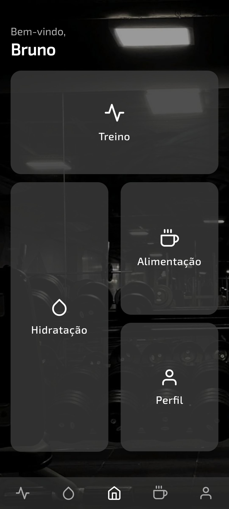
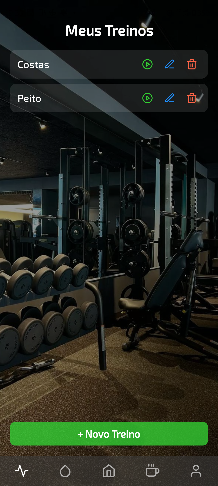
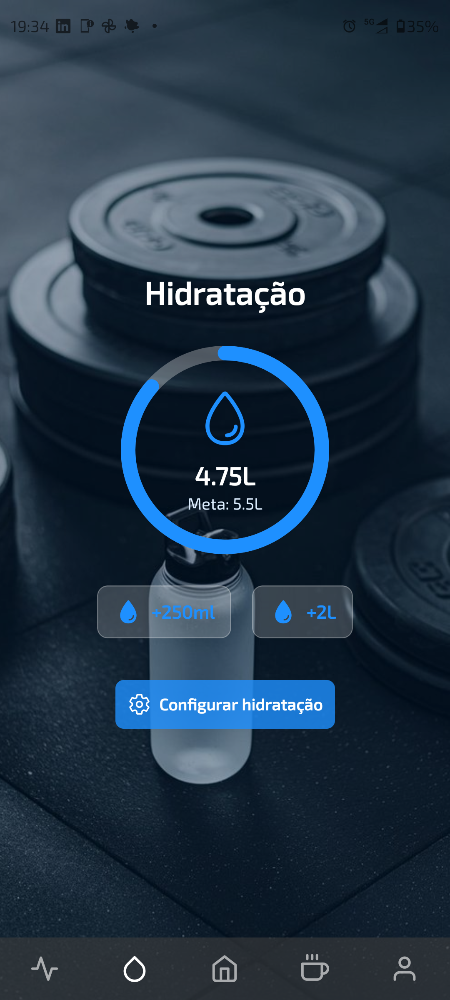
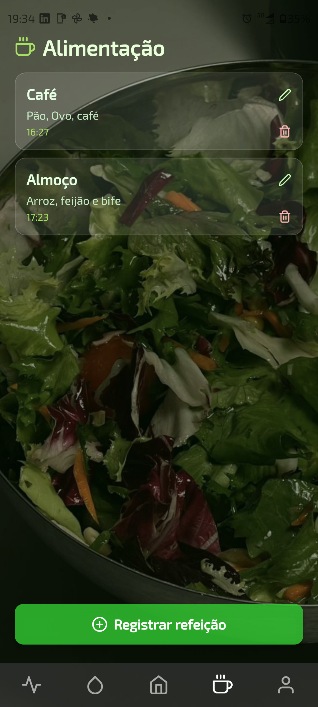
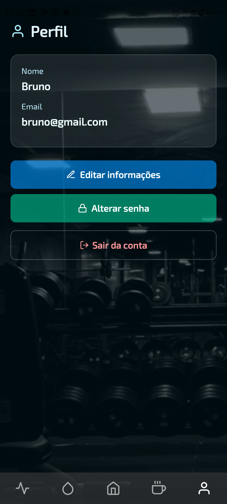

# 💪 GymApp - Seu Treino em Movimento

## 📖 Visão Geral e Requisitos

O **GymApp** é um aplicativo desenvolvido em **React Native com Expo**, criado para facilitar o acompanhamento de treinos, hidratação e alimentação de forma integrada e acessível.  
A proposta é reunir em um só lugar as principais funcionalidades de um app fitness, com **design moderno**, **navegação intuitiva** e **armazenamento local inteligente**.

### 🎯 Objetivo
Fornecer uma ferramenta simples e eficiente para que o usuário gerencie sua rotina de treinos, controle o consumo de água e mantenha hábitos saudáveis — tudo na palma da mão.

### 🧩 Requisitos Atendidos
- Interface moderna e adaptada para dispositivos móveis.  
- Armazenamento de dados com **Firebase** e **AsyncStorage**.  
- Sistema de treinos completo com séries, repetições e tempos de descanso.  
- Controle de hidratação com meta diária.  
- Registro de alimentação diária.  

---

## 💻 Tecnologias Utilizadas

| Categoria | Ferramentas / Bibliotecas |
|------------|---------------------------|
| **Ambiente** | [Expo Snack](https://snack.expo.dev) |
| **Framework** | React Native |
| **Linguagem** | JavaScript |
| **Banco de Dados** | Firebase |
| **Armazenamento Local** | AsyncStorage |
| **Bibliotecas** | React Navigation, React Hooks (useState, useEffect) |
| **Interface** | StyleSheet, TouchableOpacity, Modal, FlatList |

---

## ⚙️ Funcionalidades

### 🏋️ Treinos
- Criação e edição de exercícios personalizados.  
- Organização de treinos com séries, repetições e tempo de descanso.  
- Cronômetro de descanso com vibração e feedback visual.  
- Tela de **Execução e Progresso** do treino com design focado no usuário.  

### 💧 Hidratação
- Controle de ingestão de água diária.  
- Interface temática em tons de azul, remetendo à fluidez e bem-estar.  
- Indicador de progresso e meta personalizada.  

### 🍎 Alimentação
- Registro simples das refeições.  
- Design limpo e intuitivo, focado na praticidade.  

### 👤 Perfil
- Visualização dos dados do usuário e resumo de desempenho.  
- Interface integrada e coerente com o estilo do app.  

---

## 🎥 Demonstração

Você pode acessar o app diretamente pelo Expo Snack:  
👉 [**Abrir GymApp no Expo Snack**](https://snack.expo.dev/@brunobudano/gym-app)

📱 Para testar:
1. Acesse o link acima.  
2. Clique em **"Run"** no canto superior direito.  
3. Escolha entre:
   - **Web:** O app abrirá em uma nova aba.  
   - **My Device (Recomendado):** Baixe o app **Expo Go** no celular e escaneie o **QR Code** exibido.  

> 💡 Algumas funcionalidades, como vibração e timers de treino, funcionam melhor no dispositivo físico.

---

## 🧠 Aprendizados e Próximos Passos

Durante o desenvolvimento do **GymApp**, foi possível aprender e aplicar:
- Estruturação modular e responsiva no **React Native**.  
- Manipulação e persistência de dados com **AsyncStorage**.  
- Criação de interfaces consistentes entre diferentes telas.  
- Organização de fluxos de navegação e lógica de estado.  

### 🔮 Próximos Passos 
- Implementar gráficos de progresso e histórico de treinos.  
- Sistema de notificações para lembretes de hidratação e treino.  
- Suporte a tema escuro e personalização do layout.  

---

## 🖼️ Telas do App

| Tela | Preview |
|------|----------|
| 🏠 **Home** |  |
| 🏋️ **Treinos** |  |
| 💧 **Hidratação** |  |
| 🍎 **Alimentação** |  |
| 👤 **Perfil** |  |

---

## ✨ Desenvolvido por

**Bruno Budano Mello**  
📍 Projeto acadêmico desenvolvido no ambiente **Expo Snack**.  
💡 *“Treinar o corpo é fortalecer a mente.”*
